# theCREW

### Creator Resource Editor Workspace

> The workspace where short-form creators and their editors upload raw clips, organize drafts, and ship final cuts - without the DM chaos.

---

## Why theCREW Exists

Every day, thousands of creators on TikTok, Instagram Reels, and YouTube Shorts share raw footage with editors through DMs, WeTransfer links, and messy shared drives. Feedback gets lost in chat threads. Briefs live in someone's head. Nobody knows which cut is final.

**theCREW** solves this by giving creators and editors a single workspace where raw clips go in, organized content comes out, and AI handles the tedious parts in between.

---

## Table of Contents

- [The Problem](#the-problem)
- [The Solution](#the-solution)
- [Creator Flow Walkthrough](#creator-flow-walkthrough)
  - [1. Landing Page](#1-landing-page)
  - [2. Sign In / Sign Up](#2-sign-in--sign-up)
  - [3. Create a Workspace](#3-create-a-workspace)
  - [4. Organize Content — Create Folders](#4-organize-content--create-folders)
  - [5. Upload Files to Folders](#5-upload-files-to-folders)
  - [6. AI Brief — Upload Materials](#6-ai-brief--upload-materials)
  - [7. AI Briefing — Smart Q&A](#7-ai-briefing--smart-qa)
  - [8. Production Brief — Final Document](#8-production-brief--final-document)
  - [9. Briefs Library — One-Click Task Generation](#9-briefs-library--one-click-task-generation)
  - [10. Tasks — Kanban Board](#10-tasks--kanban-board)
  - [11. Reference Reels — AI Video Analysis](#11-reference-reels--ai-video-analysis)
- [System Architecture](#system-architecture)
  - [High-Level Architecture](#high-level-architecture)
  - [AI Pipeline Architecture (Lambda + Gemini)](#ai-pipeline-architecture-lambda--gemini)
  - [File Upload Pipeline](#file-upload-pipeline)
  - [Authentication Flow](#authentication-flow)
  - [DynamoDB Single-Table Design](#dynamodb-single-table-design)
  - [Request Flow Diagrams](#request-flow-diagrams)
- [Tech Stack](#tech-stack)
- [Key Differentiators](#key-differentiators)
- [Project Structure](#project-structure)
- [API Reference](#api-reference)
- [Running Locally](#running-locally)

---

## The Problem

| Pain Point | What happens today |
|---|---|
| **Scattered assets** | Raw clips in Google Drive, finals in Dropbox, references in DMs |
| **No brief = no direction** | Editors guess what the creator wants, leading to endless revision cycles |
| **Feedback chaos** | "Go to 0:14 and change the transition" buried in a WhatsApp thread |
| **No task tracking** | Nobody knows what's done, what's in progress, or what's blocking |
| **Reference confusion** | "Edit it like that viral reel" — which one? what specifically about it? |

## The Solution

**theCREW** is a unified workspace that replaces 5+ tools with one:

| Feature | Replaces |
|---|---|
| **File Manager** with folders and CDN delivery | Google Drive / Dropbox |
| **AI Brief Generator** with smart questioning | Manual briefs in Google Docs |
| **Kanban Task Board** with AI task generation | Trello / Notion |
| **Timestamped Video Feedback** | WhatsApp voice notes |
| **Reference Reel Analyzer** with AI breakdowns | "Just copy that vibe" conversations |

---

## Creator Flow Walkthrough

### 1. Landing Page

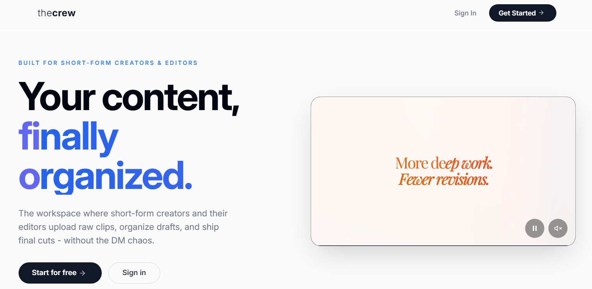

The landing page introduces theCREW with a clear value proposition: **"Your content, finally organized."** Built specifically for short-form creators and editors who need to move fast without losing track of assets.

- **"Start for free"** takes new users to sign up
- **"Sign in"** links existing users to authentication
- Frosted glass navbar with the typographic **thecrew** wordmark (light "the" + bold "crew")
- Split hero layout: tagline left, product preview right

---

### 2. Sign In / Sign Up

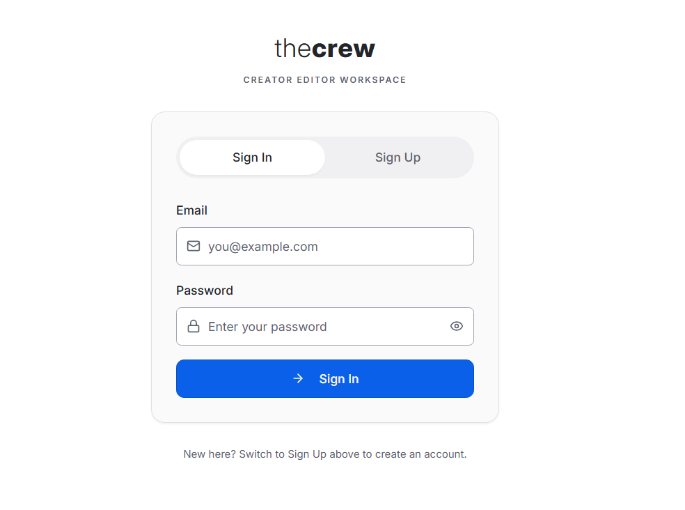

Clean authentication with tabbed Sign In and Sign Up forms. The **thecrew** wordmark sits above the subtitle "CREATOR EDITOR WORKSPACE."

- **Sign In** — email and password with visibility toggle
- **Sign Up** — creates a new account with email, password, and display name
- Passwords hashed with bcrypt before storage
- Server-side sessions managed with express-session stored in PostgreSQL
- Password strength indicator on registration

---

### 3. Create a Workspace

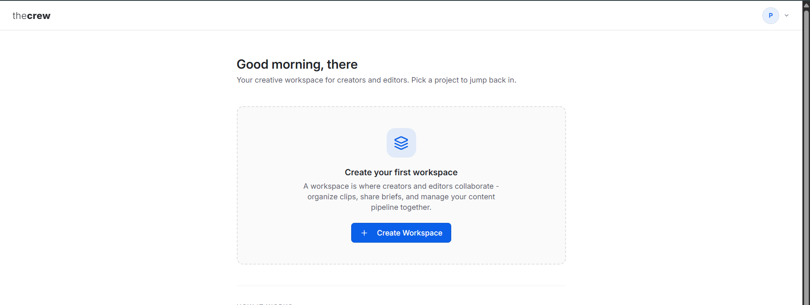

After signing in, the creator lands on the workspace selection screen with a personalized greeting.

- Each workspace represents a content project (e.g., "project - ai", "Insta reel")
- The workspace creator becomes its **admin** with full access
- An organization is auto-created behind the scenes to group workspaces and team members
- Workspace switcher in the top bar for jumping between projects
- Admin controls: invite members, manage roles, delete workspace

---

### 4. Organize Content — Create Folders

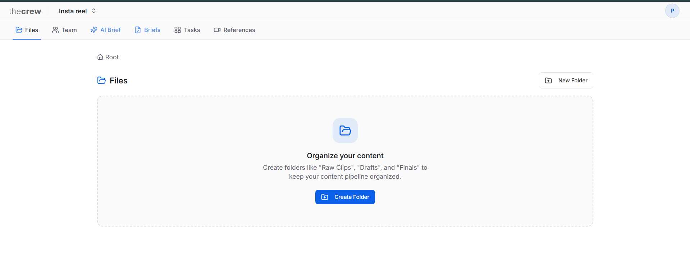

Inside a workspace, the **Files** tab is the content hub. Creators organize their pipeline with folders like "Raw Clips", "Drafts", and "Finals."

- **Horizontal tab navigation**: Files, Team, AI Brief, Briefs, Tasks, References
- **Breadcrumb navigation** shows current location
- **"New Folder"** button with empty-state guidance
- Folders stored in DynamoDB under the workspace's organization
- Nested folder support for complex content pipelines

---

### 5. Upload Files to Folders

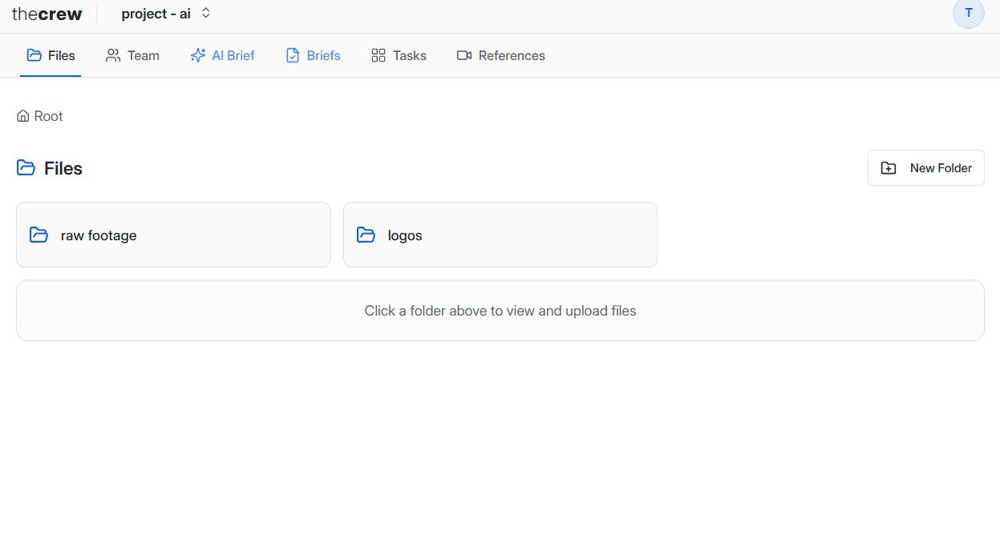

With folders created (e.g., "raw footage" and "logos"), the workspace is ready for file uploads.

- Click a folder to open it for drag-and-drop uploads
- **Direct-to-S3 uploads** via presigned URLs (no server bottleneck)
- Files served globally via **CloudFront CDN** for instant previews
- Supports images, videos, PDFs, audio, and other media formats
- In-browser preview for images and video playback

---

### 6. AI Brief — Upload Materials

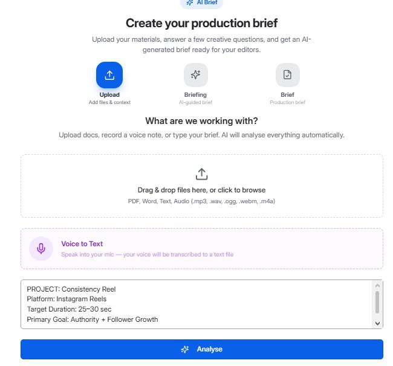

The **AI Brief** tab is where the magic begins. A 3-step wizard guides creators through building a production brief.

**Step 1: Upload & Analyse** — Provide context for the project:

- **Drag & drop files** — PDFs, Word docs, audio (.mp3, .wav, .ogg, .webm, .m4a), text files
- **Voice to Text** — Speak directly into the mic; browser speech-to-text transcribes it
- **Text input** — Type or paste project notes, goals, and references
- All materials uploaded to S3, then sent to **AWS Lambda** for AI summarization
- Lambda extracts key information from PDFs, documents, and text files
- Hit **"Analyse"** to process everything and move to the briefing step

---

### 7. AI Briefing — Smart Q&A

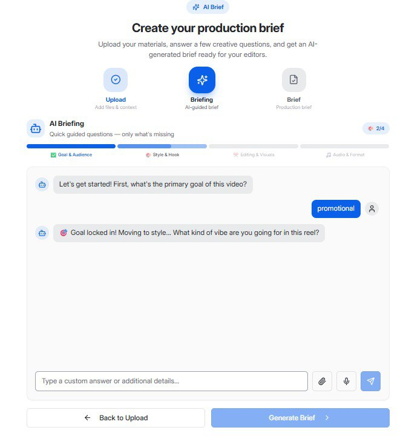

**Step 2: AI Briefing** — Gemini AI conducts a conversational interview using a 4-layer briefing framework:

| Layer | What it covers |
|-------|---------------|
| **Goal & Audience** | Primary goal, target viewers, platform, duration |
| **Style & Hook** | Visual vibe, color grade, opening hook strategy |
| **Editing & Visuals** | Cut style, transitions, captions, B-roll needs |
| **Audio & Format** | Background music, sound effects, voiceover, pacing |

Key UX innovations:
- **Progress bar** shows which layers have been covered (e.g., 2/4 completed)
- **Context-aware quick-reply chips** change based on the current layer (e.g., "promotional", "educational" for Goal layer; "fast cuts", "slow cinematic" for Editing layer)
- **Smart question reduction** — AI skips questions already answered by uploaded materials
- **Skip & Generate** — creators can generate the brief anytime without answering every question
- **File attachments** can be added mid-conversation for additional context
- **Voice input** supported during the chat

---

### 8. Production Brief — Final Document

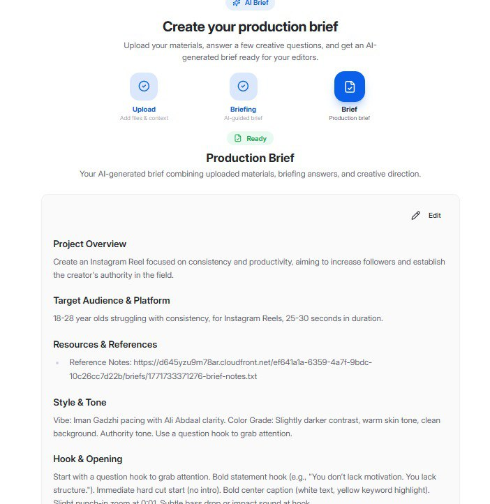

**Step 3: Production Brief** — Gemini generates a comprehensive document by combining three sources:

1. The **Lambda-generated summary** of uploaded materials
2. All **briefing answers** from the conversational Q&A
3. Any **file attachments** shared during the chat

The final document includes structured sections:
- **Project Overview** — What the video is about and its goals
- **Target Audience & Platform** — Who it's for and format specs (e.g., Instagram Reels, 25-30 sec)
- **Resources & References** — Links to uploaded reference materials on CloudFront
- **Style & Tone** — Visual direction, color grading, pacing references
- **Hook & Opening** — Specific opening strategy for the first few seconds
- **Editing Instructions** — Transitions, captions, B-roll directions
- Editable with the **"Edit"** button for manual tweaks
- Saved to DynamoDB as a completed interrogation record

---

### 9. Briefs Library — One-Click Task Generation

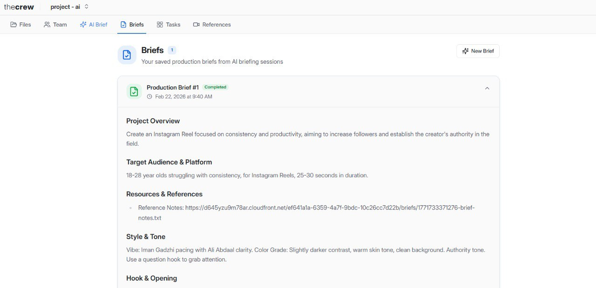

The **Briefs** tab is the library of all completed production briefs.

- Each brief is an expandable card showing title, status badge, timestamp, and a 2-line preview
- **"Generate Tasks"** button directly on each brief card — one click to auto-create editing tasks
- **Conflict-aware task generation** — AI checks existing tasks before generating new ones to prevent duplicates across multiple briefs
- If all tasks already exist, shows "No new tasks needed" instead of creating duplicates
- **"New Brief"** button to start a fresh AI briefing session
- Briefs serve as the single source of truth that editors reference when cutting

---

### 10. Tasks — Kanban Board

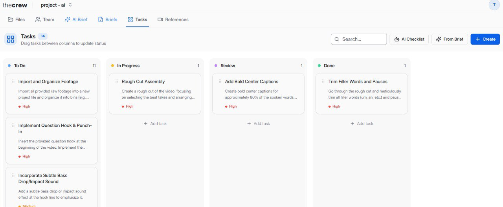

The **Tasks** tab is a full Kanban board for managing the production workflow.

- **Four columns**: To Do, In Progress, Review, Done — drag and drop to update status
- **"Generate from Brief"** — Gemini AI reads a completed production brief and auto-generates actionable editing tasks (e.g., "Import and Organize Footage", "Rough Cut Assembly", "Add Bold Center Captions")
- **"Create Task"** — manually add tasks with title, description, priority, and status
- **"AI Revision Checklist"** — generates a checklist from all task comments across the board
- **Search** — filter tasks by keyword
- Each task card shows title, description preview, and priority badge (High, Medium, Low)
- Task count per column shown in the header

**Task Detail Drawer** — clicking any task opens a full detail panel with:
- **Details tab** — title, description, status, priority, multi-member assignment
- **Feedback tab** — upload video, add timestamped comments with clickable playback badges (click "0:14" to seek)
- **AI Summary tab** — Gemini summarizes all timestamped feedback into actionable bullet points
- **Ask AI tab** — context-aware chatbot that knows the task, its comments, and video context

---

### 11. Reference Reels — AI Video Analysis

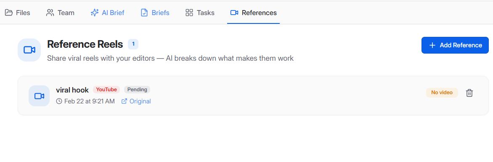

The **References** tab lets creators share viral Reels, TikToks, and Shorts with their editors, with AI breaking down exactly what makes them work.

- **Add Reference** — paste a URL from Instagram, TikTok, or YouTube + upload the video file
- **AI Analysis** — Gemini 2.0 Flash watches the video and produces a structured breakdown:
  - **Hook** — how the first 1-3 seconds grab attention
  - **Pacing & Rhythm** — beat timing, cut frequency, energy flow
  - **Transitions** — types of transitions used and when
  - **Text & Captions** — text animation style, placement, timing
  - **Audio & Music** — sound design, music selection, SFX usage
  - **Motion Graphics** — animated elements, overlays, visual effects
- Analysis summary and section chips visible directly on the card (no need to expand)
- **Editor-ready recommendations** — specific, actionable suggestions editors can apply immediately
- Platform badge (Instagram, TikTok, YouTube) and "Original" link to the source

---

## System Architecture

### High-Level Architecture

```
                              ┌─────────────────────────────┐
                              │       USERS (Browser)       │
                              │   React + TypeScript + Vite │
                              │   TanStack Query | wouter   │
                              │   shadcn/ui | Tailwind CSS  │
                              └──────────────┬──────────────┘
                                             │
                            HTTPS (REST API) │ Port 5000
                                             │
                              ┌──────────────▼──────────────┐
                              │     EXPRESS.JS BACKEND      │
                              │       (TypeScript)          │
                              │                             │
                              │  ┌───────┐  ┌────────────┐ │
                              │  │ Auth  │  │ Workspace  │ │
                              │  │Routes │  │  Routes    │ │
                              │  └───┬───┘  └─────┬──────┘ │
                              │      │            │        │
                              │  ┌───▼────────────▼──────┐ │
                              │  │    AWS Service Layer   │ │
                              │  │  S3 | DynamoDB | CF   │ │
                              │  └───┬───────┬───────┬───┘ │
                              └──────┼───────┼───────┼─────┘
                                     │       │       │
                     ┌───────────────┘       │       └───────────────┐
                     │                       │                       │
          ┌──────────▼──────────┐ ┌──────────▼──────────┐ ┌─────────▼──────────┐
          │    PostgreSQL       │ │     DynamoDB         │ │     AWS S3         │
          │    (Neon)           │ │  Single-Table Design │ │  + CloudFront CDN  │
          │                    │ │                      │ │                    │
          │  ┌──────────────┐  │ │  Organisations       │ │  Raw clips         │
          │  │    users     │  │ │  Workspaces          │ │  Edited videos     │
          │  │   sessions   │  │ │  Members             │ │  PDFs, docs        │
          │  └──────────────┘  │ │  Folders & Files     │ │  Audio files       │
          │                    │ │  Interrogations      │ │  Brief attachments │
          │  Auth only.        │ │  Tasks & Comments    │ │                    │
          │  bcrypt + sessions │ │  References          │ │  Presigned uploads │
          └────────────────────┘ │                      │ │  CDN delivery      │
                                 │  GSIs for queries    │ └────────────────────┘
                                 └──────────────────────┘

                     ┌───────────────────────────────────────────┐
                     │            EXTERNAL AI SERVICES           │
                     │                                           │
                     │  ┌─────────────────┐  ┌────────────────┐ │
                     │  │  AWS Lambda      │  │  Gemini 2.0    │ │
                     │  │  (ap-south-1)    │  │  Flash         │ │
                     │  │                  │  │                │ │
                     │  │  Summarizes      │  │  Briefing chat │ │
                     │  │  uploaded docs   │  │  Brief gen     │ │
                     │  │  (PDF, text,     │  │  Task gen      │ │
                     │  │   audio)         │  │  Summaries     │ │
                     │  │                  │  │  Video analysis│ │
                     │  │  Returns         │  │  Task chatbot  │ │
                     │  │  structured JSON │  │                │ │
                     │  └─────────────────┘  └────────────────┘ │
                     └───────────────────────────────────────────┘
```

### AI Pipeline Architecture (Lambda + Gemini)

This is the core innovation. Two AI systems work together to turn raw creator thoughts into structured production documents.

```
 STEP 1: UPLOAD & ANALYSE
 ─────────────────────────────────────────────────────────────────

 Creator uploads files          Express Backend              AWS Lambda
 (PDF, audio, text,       ──►  Stores files in S3    ──►   (ap-south-1)
  voice recordings)             via presigned URLs          uhqp6goc12.execute-api
                                                            .amazonaws.com/summary
        │                              │                          │
        │  Files go to S3              │  POST with file URLs     │
        │  directly from               │  (with retry: 3x,       │
        │  browser                     │   30s/45s timeout)       │
        │                              │                          │
        │                              │                    ┌─────▼─────┐
        │                              │                    │  Lambda   │
        │                              │                    │  reads    │
        │                              │                    │  files    │
        │                              │                    │  from S3  │
        │                              │                    │           │
        │                              │                    │  Extracts │
        │                              │                    │  text from│
        │                              │                    │  PDFs,    │
        │                              │                    │  docs,    │
        │                              │                    │  audio    │
        │                              │                    │           │
        │                              │  ◄─── JSON ────── │  Returns  │
        │                              │  { summary }      │  summary  │
        │                              │                    └───────────┘
        │                              │
        │                     Stores Interrogation
        │                     record in DynamoDB
        │                     (status: "analysed")
        │
        ▼
 STEP 2: AI BRIEFING CHAT
 ─────────────────────────────────────────────────────────────────

 Creator answers                Express Backend              Gemini 2.0 Flash
 questions via chat       ──►  Sends to Gemini:       ──►  (Google AI)
 or quick-reply chips          • Lambda summary
                               • Chat history                    │
        │                      • Briefing answers                │
        │                      • 4-layer framework               │
        │                        instructions            ┌───────▼───────┐
        │                                                │    Gemini     │
        │                              │                 │  evaluates    │
        │                              │                 │  what's       │
        │                              │                 │  already      │
        │                              │                 │  covered      │
        │                              │                 │               │
        │                              │                 │  Asks only    │
        │                              │                 │  about        │
        │                              │                 │  missing      │
        │                              │                 │  info         │
        │                              │                 │               │
        │                              │  ◄── response ──│  Returns      │
        │                              │  + layer tag    │  question +   │
        │                              │  + suggestions  │  suggestions  │
        │                              │                 └───────────────┘
        │                     Updates briefingAnswers
        │                     in DynamoDB
        │
        ▼
 STEP 3: GENERATE FINAL BRIEF
 ─────────────────────────────────────────────────────────────────

 Creator clicks              Express Backend              Gemini 2.0 Flash
 "Generate Brief"      ──►  Combines 3 sources:     ──►  (Google AI)
                             1. Lambda summary
                             2. All briefing answers          │
                             3. File attachments              │
                                                       ┌─────▼─────────┐
                                                       │   Gemini      │
                              │                        │  generates    │
                              │                        │  structured   │
                              │                        │  production   │
                              │                        │  brief with   │
                              │                        │  all sections │
                              │  ◄── final document ── │               │
                              │                        └───────────────┘
                     Saves finalDocument to
                     DynamoDB Interrogation
                     (status: "completed")

 ─────────────────────────────────────────────────────────────────
 DOWNSTREAM: TASK GENERATION
 ─────────────────────────────────────────────────────────────────

 Creator clicks              Express Backend              Gemini 2.0 Flash
 "Generate Tasks"      ──►  Fetches:                ──►
 on any brief                • Final brief content
                             • Existing tasks (for          │
                               dedup)                       │
                                                     ┌──────▼──────────┐
                              │                      │  Gemini reads   │
                              │                      │  the brief,     │
                              │                      │  generates      │
                              │                      │  actionable     │
                              │                      │  editing tasks  │
                              │                      │  with title,    │
                              │                      │  description,   │
                              │  ◄── tasks[] ─────── │  priority       │
                              │                      └─────────────────┘
                     Filters out duplicates
                     (normalized title matching
                      against existing tasks)
                     Saves new tasks to DynamoDB
```

### File Upload Pipeline

```
  Browser                    Express Backend                    AWS S3
    │                              │                              │
    │  1. Request presigned URL    │                              │
    │  POST /api/uploads/          │                              │
    │  request-url                 │                              │
    │  { fileName, fileType }      │                              │
    │ ─────────────────────────►   │                              │
    │                              │  2. Generate presigned       │
    │                              │     PUT URL for S3           │
    │                              │     (key: orgId/path/file)   │
    │  ◄─────────────────────────  │                              │
    │  { uploadUrl, key,           │                              │
    │    cloudfrontUrl }           │                              │
    │                              │                              │
    │  3. Direct upload to S3      │                              │
    │     (browser → S3, no        │                              │
    │      server bottleneck)      │                              │
    │ ─────────────────────────────────────────────────────────►  │
    │                              │                              │
    │  4. Save file record         │                              │
    │  POST /api/workspaces/       │                              │
    │  :id/files                   │                              │
    │ ─────────────────────────►   │                              │
    │                              │  5. Store metadata           │
    │                              │     in DynamoDB              │
    │  ◄─────────────────────────  │     (pk, sk, URL, type)      │
    │  { file record }             │                              │
    │                              │                              │
    │  6. Access via CloudFront    │                              │
    │     CDN (global edge cache)  │                              │
    │ ◄──────────────── https://d645yzu9m78ar.cloudfront.net ──  │
```

**Why presigned URLs?** The server never touches file bytes. A 500MB video uploads directly from the browser to S3 in one request. The server only generates the signed permission token and stores metadata.

### Authentication Flow

```
 ┌────────────┐                    ┌────────────────┐              ┌──────────────┐
 │  Browser   │                    │  Express.js    │              │  PostgreSQL  │
 │  (React)   │                    │  Backend       │              │  (Neon)      │
 └─────┬──────┘                    └───────┬────────┘              └──────┬───────┘
       │                                   │                              │
       │  POST /api/auth/register          │                              │
       │  { email, password, name }        │                              │
       │ ─────────────────────────────►    │                              │
       │                                   │  bcrypt.hash(password, 10)   │
       │                                   │  INSERT INTO users           │
       │                                   │ ────────────────────────►    │
       │                                   │  ◄────────────────────────   │
       │                                   │  Create session              │
       │                                   │  INSERT INTO sessions        │
       │                                   │ ────────────────────────►    │
       │  ◄─────────────────────────────   │                              │
       │  Set-Cookie: connect.sid=...      │                              │
       │                                   │                              │
       │  GET /api/auth/user               │                              │
       │  Cookie: connect.sid=...          │                              │
       │ ─────────────────────────────►    │                              │
       │                                   │  Lookup session              │
       │                                   │ ────────────────────────►    │
       │                                   │  ◄────────────────────────   │
       │  ◄─────────────────────────────   │                              │
       │  { id, email, firstName, ... }    │                              │
       │                                   │                              │
       │  All subsequent API calls         │                              │
       │  include session cookie           │                              │
       │  automatically                    │                              │
       │                                   │                              │
       │  Middleware: isAuthenticated       │                              │
       │  checks session before every      │                              │
       │  workspace/task/file route        │                              │
```

### DynamoDB Single-Table Design

All business data lives in one DynamoDB table (`AIFORVIZAG_file_structure`) using a hierarchical key pattern:

```
┌──────────────────────────────────────────────────────────────────────────────┐
│  Table: AIFORVIZAG_file_structure                                           │
│                                                                              │
│  ┌─────────────────────────────────────────────────────────────────────────┐ │
│  │ Partition Key (pk)    │  Sort Key (sk)                                 │ │
│  ├───────────────────────┼───────────────────────────────────────────────┤ │
│  │ ORG#<orgId>           │  METADATA                                     │ │
│  │                       │  → Organisation name, owner, createdAt        │ │
│  ├───────────────────────┼───────────────────────────────────────────────┤ │
│  │ ORG#<orgId>           │  WS#<workspaceId>                             │ │
│  │                       │  → Workspace name, description, creator       │ │
│  ├───────────────────────┼───────────────────────────────────────────────┤ │
│  │ ORG#<orgId>           │  WS#<wsId>#MEMBER#<userId>                    │ │
│  │                       │  → Role (admin/member/viewer), joinedAt       │ │
│  ├───────────────────────┼───────────────────────────────────────────────┤ │
│  │ ORG#<orgId>           │  WS#<wsId>#FOLDER#<folderId>                  │ │
│  │                       │  → Folder name, parentId (nesting)            │ │
│  ├───────────────────────┼───────────────────────────────────────────────┤ │
│  │ ORG#<orgId>           │  WS#<wsId>#FOLDER#<folderId>#FILE#<fileId>    │ │
│  │                       │  → File name, S3 key, CloudFront URL, type    │ │
│  ├───────────────────────┼───────────────────────────────────────────────┤ │
│  │ ORG#<orgId>           │  WS#<wsId>#INTERROGATION#<id>                 │ │
│  │                       │  → summary, fileUrls, briefingAnswers,        │ │
│  │                       │    finalDocument, status                       │ │
│  ├───────────────────────┼───────────────────────────────────────────────┤ │
│  │ ORG#<orgId>           │  WS#<wsId>#TASK#<taskId>                      │ │
│  │                       │  → title, description, status, priority,      │ │
│  │                       │    assignees[], sourceInterrogationId          │ │
│  ├───────────────────────┼───────────────────────────────────────────────┤ │
│  │ ORG#<orgId>           │  WS#<wsId>#TASK#<taskId>#COMMENT#<commentId>  │ │
│  │                       │  → text, timestampSec, authorId               │ │
│  ├───────────────────────┼───────────────────────────────────────────────┤ │
│  │ ORG#<orgId>           │  WS#<wsId>#REFERENCE#<refId>                  │ │
│  │                       │  → title, sourceUrl, sourcePlatform,          │ │
│  │                       │    videoObjectPath, analysis, analysisStatus   │ │
│  └───────────────────────┴───────────────────────────────────────────────┘ │
│                                                                              │
│  GSIs:                                                                       │
│  ├── orgId-index  (orgId → sk)  — Query all entities for an org             │
│  └── createdBy-index (createdBy) — Query entities by creator                │
│                                                                              │
│  Query patterns:                                                             │
│  ├── All workspaces in org: pk=ORG#<orgId>, sk BEGINS_WITH "WS#"           │
│  ├── All folders in workspace: pk=ORG#<orgId>, sk BEGINS_WITH "WS#x#FOLDER"│
│  ├── All tasks in workspace: pk=ORG#<orgId>, sk BEGINS_WITH "WS#x#TASK#"   │
│  └── All comments on task: pk=ORG#<orgId>, sk BEGINS_WITH "WS#x#TASK#y#C"  │
└──────────────────────────────────────────────────────────────────────────────┘
```

**Why single-table?** One table means one provisioning config, one backup policy, and one set of GSIs. The hierarchical sort key pattern (`WS#x#FOLDER#y#FILE#z`) enables efficient queries at every level of the hierarchy using `BEGINS_WITH` conditions.

### Request Flow Diagrams

**AI Brief: End-to-End (Creator uploads files to final brief)**

```
Creator          React App          Express          Lambda          S3          DynamoDB       Gemini
  │                 │                  │                │             │              │             │
  │  Upload files   │                  │                │             │              │             │
  ├────────────────►│                  │                │             │              │             │
  │                 │  Get presigned   │                │             │              │             │
  │                 ├─────────────────►│                │             │              │             │
  │                 │  { uploadUrl }   │                │             │              │             │
  │                 │◄─────────────────┤                │             │              │             │
  │                 │                  │                │             │              │             │
  │                 │  PUT file directly to S3          │             │              │             │
  │                 ├──────────────────────────────────────────────►  │              │             │
  │                 │                  │                │             │              │             │
  │  Click Analyse  │                  │                │             │              │             │
  ├────────────────►│                  │                │             │              │             │
  │                 │  POST /summarize │                │             │              │             │
  │                 ├─────────────────►│                │             │              │             │
  │                 │                  │  POST file URLs│             │              │             │
  │                 │                  ├───────────────►│             │              │             │
  │                 │                  │                │  Read files │              │             │
  │                 │                  │                ├────────────►│              │             │
  │                 │                  │                │◄────────────┤              │             │
  │                 │                  │  { summary }   │             │              │             │
  │                 │                  │◄───────────────┤             │              │             │
  │                 │                  │                │             │   Save        │             │
  │                 │                  ├────────────────────────────────────────────►│             │
  │                 │  { interrogation}│                │             │              │             │
  │                 │◄─────────────────┤                │             │              │             │
  │                 │                  │                │             │              │             │
  │  Answer Q&A     │                  │                │             │              │             │
  ├────────────────►│  POST /chat      │                │             │              │             │
  │                 ├─────────────────►│                │             │              │             │
  │                 │                  ├──────────────────────────────────────────────────────────►│
  │                 │                  │                │             │              │  AI response│
  │                 │                  │◄──────────────────────────────────────────────────────────┤
  │                 │  { response,     │                │             │              │             │
  │                 │    suggestions } │                │             │              │             │
  │                 │◄─────────────────┤                │             │              │             │
  │                 │                  │                │             │              │             │
  │  Generate Brief │                  │                │             │              │             │
  ├────────────────►│  POST /gen-final │                │             │              │             │
  │                 ├─────────────────►│                │             │              │             │
  │                 │                  ├──────────────────────────────────────────────────────────►│
  │                 │                  │                │             │              │  Final doc  │
  │                 │                  │◄──────────────────────────────────────────────────────────┤
  │                 │                  ├────────────────────────────────────────────►│             │
  │                 │  { finalDoc }    │                │             │              │             │
  │                 │◄─────────────────┤                │             │              │             │
  │  View brief     │                  │                │             │              │             │
  │◄────────────────┤                  │                │             │              │             │
```

**Reference Reel Analysis Flow**

```
Creator          React App          Express          S3              Gemini
  │                 │                  │               │                │
  │  Add reference  │                  │               │                │
  │  (URL + video)  │                  │               │                │
  ├────────────────►│                  │               │                │
  │                 │  Upload video    │               │                │
  │                 ├─────────────────────────────────►│                │
  │                 │                  │               │                │
  │                 │  POST /references│               │                │
  │                 ├─────────────────►│               │                │
  │                 │                  │  Save to DB   │                │
  │                 │  { reference }   │               │                │
  │                 │◄─────────────────┤               │                │
  │                 │                  │               │                │
  │  Click Analyse  │                  │               │                │
  ├────────────────►│                  │               │                │
  │                 │  POST /analyze   │               │                │
  │                 ├─────────────────►│               │                │
  │                 │                  │  Download     │                │
  │                 │                  │  video from S3│                │
  │                 │                  │◄──────────────┤                │
  │                 │                  │               │                │
  │                 │                  │  Send video   │                │
  │                 │                  │  to Gemini    │                │
  │                 │                  ├───────────────────────────────►│
  │                 │                  │               │   Structured   │
  │                 │                  │               │   analysis:    │
  │                 │                  │               │   Hook, Pacing │
  │                 │                  │               │   Transitions  │
  │                 │                  │               │   Text, Audio  │
  │                 │                  │               │   Motion GFX   │
  │                 │                  │◄───────────────────────────────┤
  │                 │                  │  Save analysis│                │
  │                 │                  │  to DynamoDB  │                │
  │                 │  { analysis }    │               │                │
  │                 │◄─────────────────┤               │                │
  │  View breakdown │                  │               │                │
  │◄────────────────┤                  │               │                │
```

---

## Tech Stack

| Layer | Technology | Why |
|-------|-----------|-----|
| **Frontend** | React + TypeScript, Vite | Fast builds, type safety, HMR |
| **UI Library** | shadcn/ui + Tailwind CSS | Accessible components, rapid styling |
| **State Management** | TanStack Query v5 | Server state caching, auto-invalidation |
| **Routing** | wouter | Lightweight, hooks-based routing |
| **Backend** | Express.js + TypeScript | Simple, battle-tested, full TypeScript |
| **Auth Database** | PostgreSQL (Neon) | Reliable relational store for users/sessions |
| **Business Database** | AWS DynamoDB | Single-table design, infinite scale, sub-10ms reads |
| **File Storage** | AWS S3 + CloudFront CDN | Presigned uploads, global edge delivery |
| **AI Summarization** | AWS Lambda (ap-south-1) | Serverless document extraction, auto-scaling |
| **AI Engine** | Google Gemini 2.0 Flash | Fast multimodal AI for text and video analysis |
| **Auth** | bcrypt + express-session | Industry-standard password hashing, server sessions |

---

## Key Differentiators

| Feature | theCREW | Typical Tools |
|---------|---------|---------------|
| **AI Brief from raw notes** | Upload anything, AI interviews you, generates structured brief | Manual Google Doc |
| **Smart question reduction** | AI skips what's already covered in uploads | N/A |
| **Context-aware quick replies** | Chips change per briefing layer | Static forms |
| **One-click task generation** | Brief to Kanban tasks in one click | Manual task creation |
| **Conflict-aware task gen** | Checks existing tasks, prevents duplicates | N/A |
| **Timestamped video feedback** | Click "0:14" to seek to that moment | "Go to around 14 seconds" |
| **AI reference analysis** | Upload a viral reel, get structured breakdown of what makes it work | "Edit it like that one" |
| **Presigned S3 uploads** | Files go browser-to-S3 directly (no server bottleneck) | Server-proxied uploads |

---

## Project Structure

```
theCREW/
├── client/
│   └── src/
│       ├── pages/
│       │   ├── landing.tsx             # Landing page with hero section
│       │   ├── auth.tsx                # Sign In / Sign Up with password strength
│       │   ├── workspace-layout.tsx    # Main app shell with tab routing
│       │   ├── profile.tsx             # Profile settings (name, password)
│       │   ├── about.tsx               # About page
│       │   ├── pricing.tsx             # Pricing page
│       │   ├── blog.tsx                # Blog page
│       │   ├── changelog.tsx           # Changelog page
│       │   ├── contact.tsx             # Contact page
│       │   ├── help-center.tsx         # Help center
│       │   ├── support.tsx             # Support page
│       │   ├── privacy-policy.tsx      # Privacy policy
│       │   └── request-feature.tsx     # Feature request page
│       ├── components/
│       │   ├── tabs/
│       │   │   ├── folders-tab.tsx     # File & folder management with uploads
│       │   │   ├── users-tab.tsx       # Team member management (invite, roles)
│       │   │   ├── interrogator-tab.tsx # 3-step AI briefing wizard
│       │   │   ├── final-agenda-tab.tsx # Briefs library with task generation
│       │   │   ├── tasks-tab.tsx       # Kanban board + task detail drawer
│       │   │   └── resources-tab.tsx   # Reference reels + AI video analysis
│       │   ├── page-navbar.tsx         # Shared frosted glass navigation bar
│       │   ├── page-footer.tsx         # Shared footer
│       │   ├── crew-logo.tsx           # Typographic wordmark component
│       │   └── slide-in-button.tsx     # Animated CTA button
│       ├── hooks/
│       │   ├── use-auth.ts             # Auth context and user state
│       │   ├── use-toast.ts            # Toast notification hook
│       │   └── use-in-view.ts          # Intersection observer hook
│       ├── lib/
│       │   ├── queryClient.ts          # TanStack Query config + apiRequest
│       │   └── auth-utils.ts           # Auth error handling utilities
│       └── App.tsx                     # Route definitions
├── server/
│   ├── routes.ts                       # All REST API endpoints (50+ routes)
│   ├── storage.ts                      # Auth storage interface (PostgreSQL)
│   ├── db.ts                           # PostgreSQL connection (Neon)
│   ├── index.ts                        # Server entry point
│   ├── vite.ts                         # Vite dev server integration
│   ├── aws/
│   │   ├── config.ts                   # AWS SDK clients (S3, DynamoDB, CloudFront)
│   │   ├── setup.ts                    # Auto-provisions S3 bucket, DynamoDB table,
│   │   │                               #   CloudFront distribution + GSIs on startup
│   │   └── fileService.ts             # All DynamoDB CRUD operations
│   └── replit_integrations/
│       ├── auth/                       # Email/password auth handlers
│       └── object_storage/             # Legacy object storage (Replit)
├── shared/
│   ├── schema.ts                       # TypeScript interfaces for all entities
│   └── models/
│       └── auth.ts                     # Drizzle ORM models (users, sessions)
└── package.json
```

---

## API Reference

### Authentication
| Method | Endpoint | Description |
|--------|----------|-------------|
| POST | `/api/auth/register` | Register with email + password |
| POST | `/api/auth/login` | Sign in |
| POST | `/api/auth/logout` | Sign out (destroy session) |
| GET | `/api/auth/user` | Get current user profile |
| PATCH | `/api/auth/user` | Update profile (firstName, lastName) |
| POST | `/api/auth/change-password` | Change password |

### Workspaces & Organization
| Method | Endpoint | Description |
|--------|----------|-------------|
| GET | `/api/workspaces` | List user's workspaces |
| POST | `/api/workspaces` | Create workspace (auto-creates org) |
| GET | `/api/workspaces/:id` | Get workspace details |
| DELETE | `/api/workspaces/:id` | Delete workspace |
| GET | `/api/workspaces/:id/members` | List workspace members |
| POST | `/api/workspaces/:id/members` | Add member (email + role) |
| DELETE | `/api/workspaces/:wsId/members/:memberId` | Remove member |

### Files & Folders
| Method | Endpoint | Description |
|--------|----------|-------------|
| GET | `/api/workspaces/:id/folders` | List folders in workspace |
| POST | `/api/workspaces/:id/folders` | Create folder |
| DELETE | `/api/workspaces/:wsId/folders/:folderId` | Delete folder + S3 files |
| GET | `/api/workspaces/:wsId/folders/:folderId/files` | List files in folder |
| POST | `/api/workspaces/:id/files` | Create file record |
| DELETE | `/api/workspaces/:wsId/files/:fileId` | Delete file + S3 object |
| POST | `/api/uploads/request-url` | Get presigned S3 upload URL |

### AI Briefing (Interrogator)
| Method | Endpoint | Description |
|--------|----------|-------------|
| POST | `/api/interrogator/upload-text` | Convert text input to .txt on S3 |
| POST | `/api/interrogator/summarize` | Send files to Lambda for summarization |
| GET | `/api/workspaces/:id/interrogations` | List all interrogations |
| POST | `/api/interrogator/chat` | Gemini AI briefing chat (4-layer framework) |
| POST | `/api/interrogator/generate-final` | Generate final production brief |

### Tasks
| Method | Endpoint | Description |
|--------|----------|-------------|
| GET | `/api/workspaces/:id/tasks` | List tasks |
| POST | `/api/workspaces/:id/tasks` | Create task manually |
| PATCH | `/api/workspaces/:wsId/tasks/:taskId` | Update task (status, priority, assignees) |
| DELETE | `/api/workspaces/:wsId/tasks/:taskId` | Delete task |
| POST | `/api/workspaces/:id/tasks/generate` | AI auto-generate tasks from brief |
| GET | `/api/workspaces/:wsId/tasks/:taskId/comments` | List task comments |
| POST | `/api/workspaces/:wsId/tasks/:taskId/comments` | Add timestamped comment |
| POST | `/api/workspaces/:wsId/tasks/revision-checklist` | AI revision checklist from all comments |
| POST | `/api/workspaces/:wsId/tasks/:taskId/summarize` | AI summary of task comments |
| POST | `/api/workspaces/:wsId/tasks/:taskId/chat` | Task-aware AI chatbot |

### Reference Reels
| Method | Endpoint | Description |
|--------|----------|-------------|
| GET | `/api/workspaces/:id/references` | List references |
| POST | `/api/workspaces/:id/references` | Add reference (URL + platform) |
| DELETE | `/api/workspaces/:wsId/references/:refId` | Delete reference |
| POST | `/api/workspaces/:wsId/references/:refId/analyze` | AI video analysis (Gemini) |

---

## Running Locally

```bash
npm run dev
```

Starts both the Express backend and Vite frontend on **port 5000**.

```bash
npm run db:push
```

Pushes auth schema changes to PostgreSQL.

### Environment Variables Required

| Variable | Purpose |
|----------|---------|
| `DATABASE_URL` | PostgreSQL connection string (Neon) |
| `GEMINI_API_KEY` | Google Gemini 2.0 Flash API key |
| `AWS_ACCESS_KEY_ID` | AWS credentials for S3/DynamoDB/CloudFront |
| `AWS_SECRET_ACCESS_KEY` | AWS credentials |
| `AWS_REGION` | AWS region (default: ap-south-1) |
| `SESSION_SECRET` | Express session encryption key |

---

*Built for creators who move fast and editors who keep up.*
